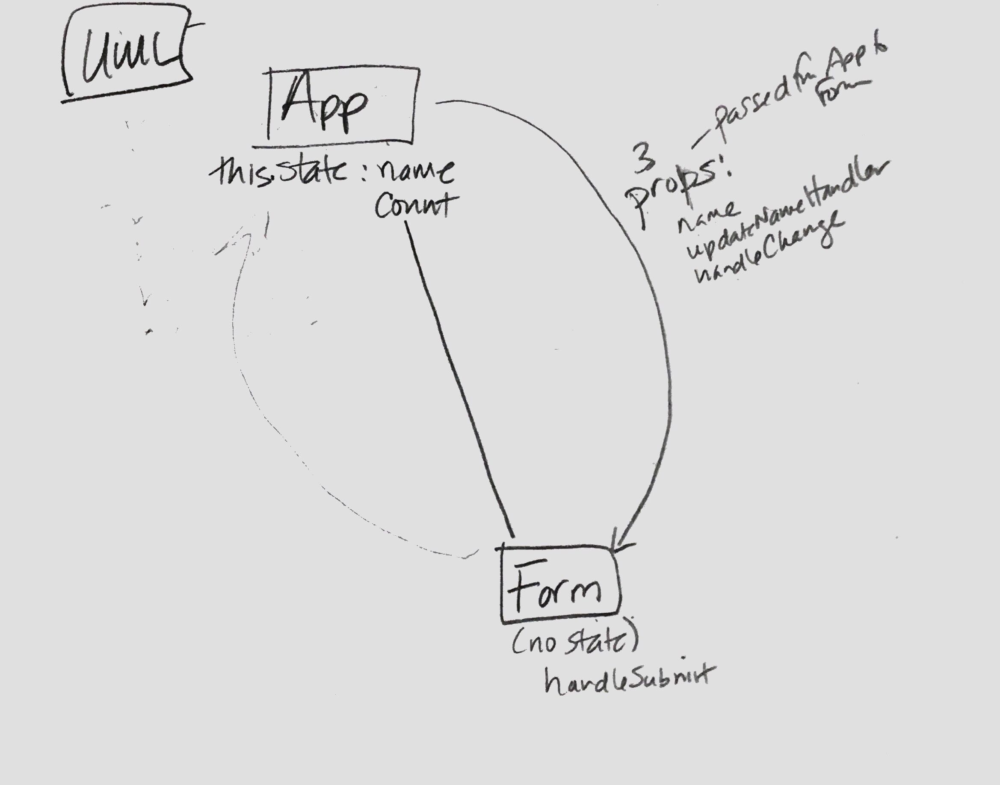

# lab-28-props-and-state-c-external-state-practice

### Author: Gina Pultorak

### Links and Resources
* [submission PR](https://github.com/ginapult-401-advanced-javascript/lab-28-props-and-state-c-external-state-practice/pull/1)
* [travis](https://travis-ci.com/ginapult-401-advanced-javascript/lab-28-props-and-state-c-external-state-practice)
* [front-end](https://lab-28-props-and-state.netlify.com/)

#### Documentation
* [jsdoc](https://ginapult-deploymentworkshop.herokuapp.com/docs/) (Server assignments)

#### UML

